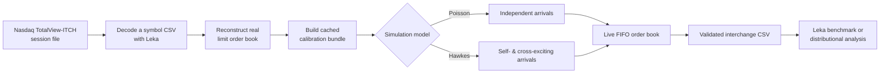
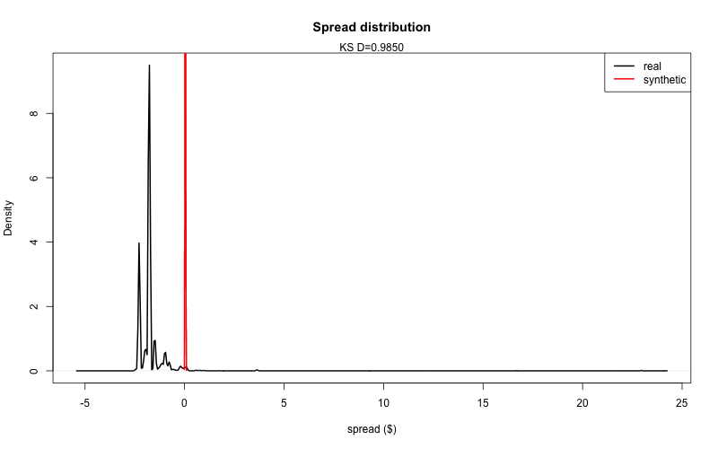
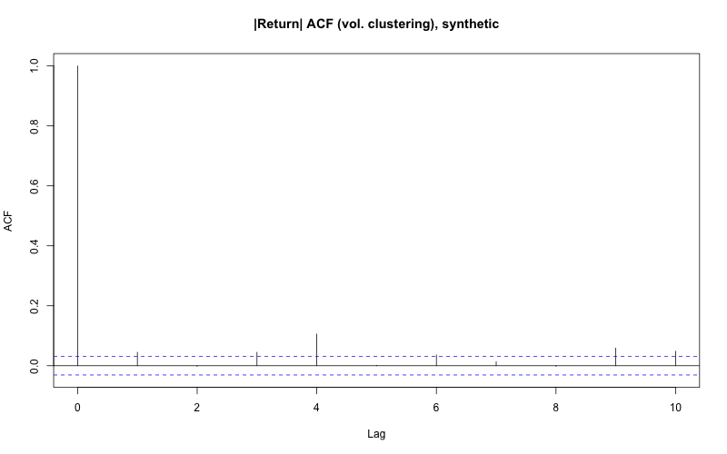

# Market Simulator

An event-driven **limit order book market simulator** for generating realistic, replayable equity order flow from Nasdaq TotalView-ITCH data. It calibrates a Cont–Stoikov–Talreja-style Poisson baseline and a Hawkes-process upgrade, evolves prices through an actual FIFO order book, and exports a validated event stream that can be replayed by Leka's matching engine.

Use it to benchmark market-data and matching-engine software, study market microstructure, or compare synthetic order flow with a real Nasdaq trading session.

## What it does

- Calibrates limit-order arrivals, market-order sizes, cancellation behavior, and book state from a decoded Nasdaq TotalView-ITCH session.
- Simulates a live, price-time-priority order book. The mid-price is *emergent* from order flow—it is never imposed as an external random walk.
- Offers two models behind one interface:
  - **Poisson** — independent limit and market-order arrivals, with cancellations proportional to resting depth.
  - **Hawkes** — the same baseline plus exponentially decaying trade self-excitation and trade-to-cancellation cross-excitation.
- Emits a self-contained, nanosecond-resolution interchange CSV (`NEW`, `CANCEL`, `REDUCE`) compatible with Leka.
- Replays real and synthetic streams through the same reconstruction engine and compares spread, depth, lifetimes, fill probability, return dependence, volatility clustering, and trade sizes.



## Results at a glance

The analysis replays real ITCH and synthetic data using identical book-reconstruction logic. Black is real data; red is synthetic data. The plots below are committed example outputs for AAPL on Nasdaq BX, 2019-07-30; `scripts/analyze.R MSFT` and `INTC` write the equivalent `results/plots/MSFT_*`/`INTC_*` files, and the pattern across all three is the same one described in [Known limitations](#known-limitations) below.

| Spread distribution | Depth near the touch |
| --- | --- |
|  |  |
| **Order lifetimes** | **Fill probability by queue position** |
|  |  |
| **Poisson volatility clustering** | **Hawkes volatility clustering** |
|  |  |

The Hawkes model is designed to capture clustered activity that a memoryless Poisson process cannot; see [Known limitations](#known-limitations) for why these particular plots don't yet show it working. Treat all figures as diagnostics, not a claim of universal fit: they depend on the selected symbol, venue, date, calibration, and simulation seed.

## Requirements

- R 4.x
- R packages: `data.table`, `bit64`, and `survival`
- `curl`, `gzip`, and standard Unix utilities to download and unpack ITCH data
- [Leka](../leka) checked out as a sibling repository for ITCH decoding and optional matching-engine benchmarks
- CMake and a C++ compiler only for the optional Leka benchmark

Install the R dependencies:

```r
install.packages(c("data.table", "bit64", "survival"))
```

Clone the two repositories side by side if needed:

```text
workspace/
├── leka/
└── market-simulator/
```

`scripts/benchmark.R` looks for `../leka` by default. Set `LEKA_REPO_PATH` when it lives elsewhere.

## Quick start

From the repository root, once a calibration cache exists for the symbol you want (AAPL, MSFT, and INTC are bundled; see below to add more):

```bash
Rscript scripts/simulate.R AAPL
```

Every script in `scripts/` takes the symbol as its first argument and defaults to `AAPL` if omitted. This runs ten simulated minutes for both models with a fixed seed, validates their schema and book state, prints price diagnostics, and writes:

```text
data/processed/sim_events_poisson_AAPL.csv
data/processed/sim_events_hawkes_AAPL.csv
```

To run every included test file:

```bash
for test in tests/test_*.R; do Rscript "$test"; done
```

## Full workflow: from ITCH to synthetic order flow

### 1. Download a Nasdaq ITCH session

Choose a date in `YYYYMMDD` form and a venue: `bx` (default), `nasdaq`, or `psx`.

```bash
scripts/fetch_itch.sh 20190730 bx
```

This downloads the original compressed session, checks available disk space, verifies a published checksum when available, and decompresses it to `data/raw/itch/`. Full ITCH sessions are large—plan disk capacity accordingly.

### 2. Decode one or more symbols with Leka

Use Leka's `tools/itch/itch_to_csv` on the decompressed session file. `--symbol` is repeatable, so decoding several symbols out of the same session file is one pass over it, not one per symbol:

```bash
cd ../leka
./build/itch_to_csv --input data/sample/20190730.BX_ITCH_50 \
  --symbol AAPL --symbol MSFT --symbol INTC \
  --output /tmp/multi_symbol_raw.csv
```

That produces one combined CSV with a `symbol` column; split it per symbol and place each at `data/raw/20190730.BX.<SYMBOL>.csv` in this repo (AAPL, MSFT, and INTC are already there). Adding a new symbol is just: decode it, drop the file at that path, and run steps 3-6 below with its ticker as the argument — nothing else in the pipeline is symbol-specific.

### 3. Build a reusable calibration cache

```bash
Rscript scripts/build_calibration_cache.R AAPL
```

The first pass per symbol reconstructs the real book and can take several minutes (roughly proportional to that symbol's row count: ~5 min for AAPL's ~192k rows, ~4 min for MSFT, ~1-2 min for INTC). It writes:

```text
data/processed/calibration_AAPL_BX_20190730.rds
```

The cache preserves fitted distributions, recovered aggressor events, market-order intensity, and state-grid information, so later simulations avoid reconstructing the source book.

### 4. Generate Poisson and Hawkes simulations

```bash
Rscript scripts/simulate.R AAPL
```

Change `duration_s`, seed, and model settings in `scripts/simulate.R`, or call the simulation API directly:

```r
source("R/types.R")
source("R/price_model.R")
source("R/event_generator.R")

calibration <- readRDS("data/processed/calibration_AAPL_BX_20190730.rds")
sim <- simulate_market(calibration, duration_s = 600, model = "hawkes", seed = 1)
validate_simulation(sim, calibration)
write_interchange_csv(sim$events, "data/processed/my_hawkes_events.csv")
```

`simulate_market()` supports `model = "poisson"` or `model = "hawkes"`. Hawkes's branching ratio and decay rate are fit by maximum likelihood against that symbol's recovered real aggressor timestamps (see `fit_hawkes_exponential()` in `R/distributions.R`) whenever there are enough events; otherwise it falls back to an assumed value and says so via `warning()`.

### 5. Compare synthetic flow with real flow

```bash
Rscript scripts/analyze.R AAPL
```

The analysis translates the real ITCH stream to the same interchange schema, replays real and synthetic streams through the same book engine, prints fit statistics, and writes plots to `results/plots/` tagged with the symbol and model (e.g. `AAPL_hawkes_spread.png`).

### 6. Benchmark the Leka matching engine (optional)

```bash
Rscript scripts/benchmark.R AAPL
```

This is a real integration, not just a shared file format: the script writes the simulator's actual output through `write_interchange_csv()`, then shells out to Leka's compiled `benchmark_interchange` binary (built from `leka_core` if not already present), which parses the CSV, constructs a genuine `lob::OrderBook` and `lob::MatchingEngine`, and calls the real `processEvent()` on every row — the same C++ code path Leka runs in production. It reports p50, p90, p99, p99.9, and maximum latency by event category (parsing is excluded from the measurement) for the real, Poisson, and Hawkes event streams, and flags any category where real and synthetic latency diverge by more than 2x.

## Model design

### Poisson baseline

The baseline follows the core Cont–Stoikov–Talreja idea:

- Limit orders arrive as independent homogeneous Poisson processes at discrete distances from the opposite best quote.
- Buy and sell market orders arrive as independent Poisson processes.
- Cancellations occur at a rate proportional to current resting depth.

Rates and order-size pools are calibrated from the source session. The cancellation rate depends on the current simulated book, but not on event history.

### Hawkes upgrade

The Hawkes mode keeps the same limit-order process while adding exponentially decaying excitation:

- A market order raises the near-term rate of subsequent market orders (self-excitation).
- It also raises the near-term cancellation rate (cross-excitation).
- The branching ratio and decay are estimated from recovered aggressor timestamps where enough observations are available.

Both modes use the same Gillespie-style event loop. For Hawkes flow, the sampler uses Ogata thinning; for the Poisson baseline, the same loop reduces to exact direct sampling.

### Live order book and price formation

The simulator maintains separate bid and ask price levels, individual resting orders, total depth, and FIFO queues. A market order consumes the opposite best level in price-time order and emits the corresponding `REDUCE` or `CANCEL` events. The mid-price is calculated after every applied event from the current best bid and ask, rather than sampled independently.

## Interchange event schema

Each output row is self-contained and has the following columns:

| Column | Meaning |
| --- | --- |
| `seq` | Strictly increasing event sequence number. |
| `ts_ns` | Non-decreasing `bit64::integer64` timestamp in nanoseconds. |
| `event` | `NEW`, `CANCEL`, or `REDUCE`. |
| `order_id` | Non-negative integer order identifier. |
| `side` | `BUY` or `SELL`. |
| `type` | `LIMIT` or `MARKET`. |
| `price` | Limit price in fixed-point 1/10,000-dollar units; blank for market orders. |
| `quantity` | Non-negative integer quantity. |

`CANCEL` removes a resting order. `REDUCE` shrinks it while preserving queue priority. Repricing or increasing size is represented as `CANCEL` followed by `NEW`. `validate_interchange()` checks these constraints before `write_interchange_csv()` exports a file.

Example:

```csv
seq,ts_ns,event,order_id,side,type,price,quantity
1,1,NEW,1,BUY,LIMIT,1000000,300
2,1,NEW,2,SELL,LIMIT,1000100,300
3,25000000,NEW,3,BUY,MARKET,,100
4,25000000,REDUCE,2,SELL,LIMIT,1000100,200
```

## Repository layout

```text
R/
  price_model.R        Live FIFO limit-order-book primitives
  event_generator.R    Poisson/Hawkes arrival models and simulation driver
  distributions.R      ITCH reconstruction and calibration routines
  aggressors.R         Aggressor recovery and intensity fitting
  types.R              Interchange schema, validation, and CSV writer
  data_loader.R        Typed ITCH CSV loader
scripts/
  fetch_itch.sh                ITCH downloader and decompressor
  build_calibration_cache.R    One-time calibration builder
  simulate.R                   Generate and validate both models
  analyze.R                    Real-vs-synthetic distributional analysis
  benchmark.R                  Optional Leka latency benchmark
tests/                  Standalone R regression tests
results/plots/          Generated diagnostic charts
```

## Known limitations

Real-vs-synthetic comparison (`scripts/analyze.R`) is consistent across all three bundled symbols, which means these are genuine properties of the current model, not one-symbol noise:

- **Spread and order-lifetime distributions diverge sharply** from real data (KS D routinely > 0.7, lifetime comparison at D=1.0 across every symbol). The lifetime number is partly a methodology artifact — real sessions run ~16 hours, synthetic runs are capped at 600s, so raw lifetime magnitudes aren't directly comparable yet — but the spread gap looks real.
- **Volatility clustering is present in real data but nearly absent from both synthetic models.** The Hawkes branching ratio and decay are fit by real MLE now (not assumed), but that fit converges to a decay of several hundred per second — sub-millisecond excitation memory — on every symbol tested. That's a real property of how fast real trade bursts cluster, but it means the fitted Hawkes model is statistically indistinguishable from the Poisson baseline at the ~1-second resolution this analysis measures clustering at. Seeing the Hawkes effect would need comparing at millisecond resolution instead.
- **Depth profile and fill-probability-by-queue-position match well** (normalized RMSE typically < 0.1) across all three symbols — these directly reflect calibrated inputs being reproduced correctly.
- **Real return autocorrelation is robustly strongly negative** (-0.48 to -0.58 at lag 1 across AAPL/MSFT/INTC, consistent with bid-ask bounce) while synthetic is near zero in both models — a genuine, unresolved gap.

In short: the pipeline is validated end-to-end (real bugs found and fixed by actually running data through it), and it's already useful for latency benchmarking against Leka, but it is not yet a statistically faithful synthetic-market generator.

## Important notes

- This is a research and benchmarking simulator, not investment advice, an execution system, or a price forecast.
- Bundled out of the box: AAPL, MSFT, and INTC on Nasdaq BX, 2019-07-30. Nothing in the pipeline is hard-coded to a specific symbol — every script takes the ticker as its first argument — so adding another is just decoding it (step 2) and running steps 3-6 with its ticker.
- ITCH data availability, licensing, and usage terms are governed by Nasdaq. Confirm that your intended use complies with the applicable terms.
- Synthetic output is reproducible when you keep the calibration, model settings, and seed fixed.

## License

Distributed under the terms in [LICENSE](LICENSE).
