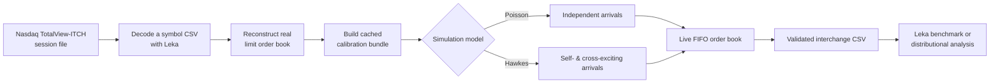
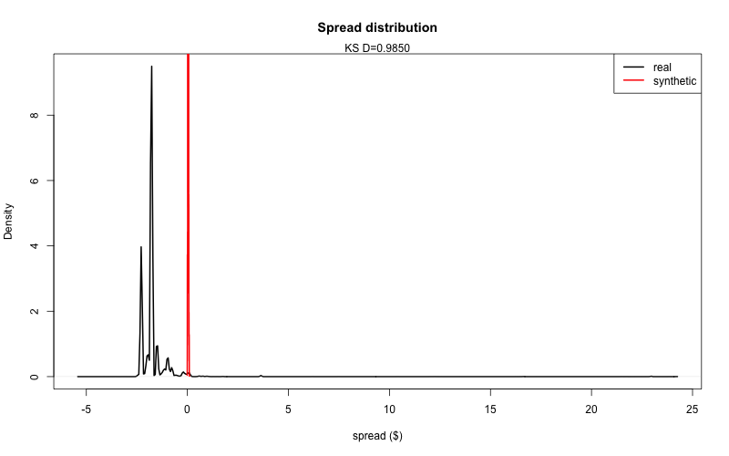
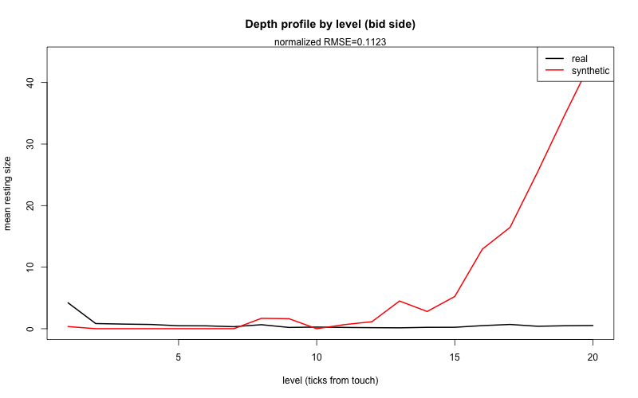
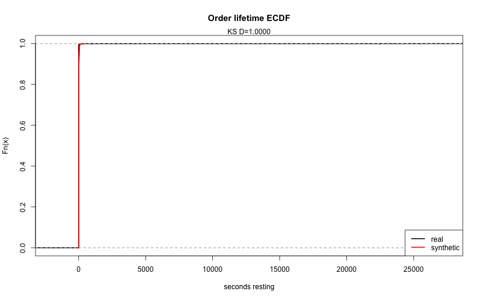
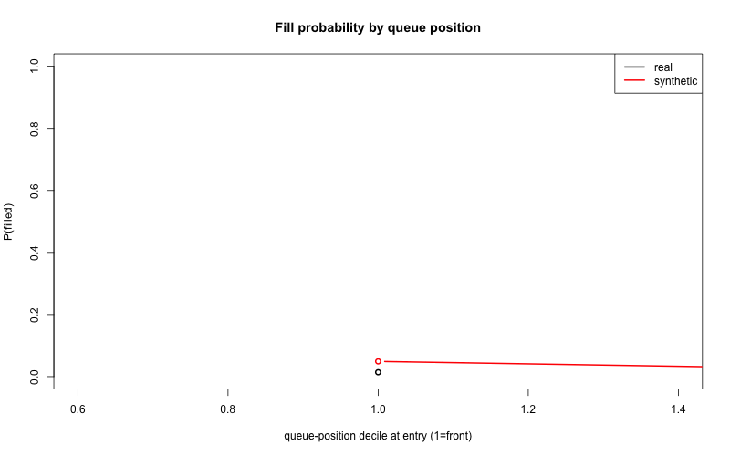
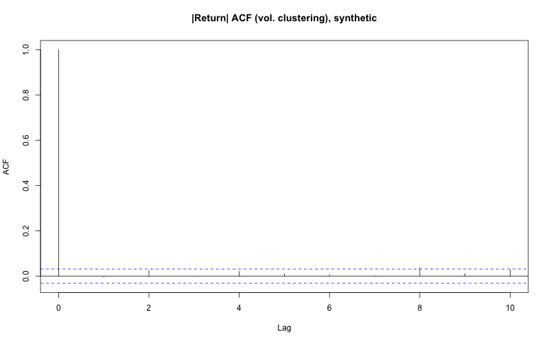
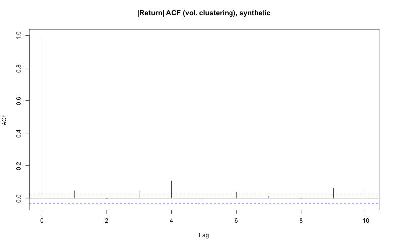

# Market Simulator

An event-driven **limit order book market simulator** for generating realistic, replayable equity order flow from Nasdaq TotalView-ITCH data. It calibrates a Cont–Stoikov–Talreja-style Poisson baseline and a Hawkes-process upgrade, evolves prices through an actual FIFO order book, and exports a validated event stream that can be replayed by Leka's matching engine.

Use it to benchmark market-data and matching-engine software, study market microstructure, or compare synthetic order flow with a real Nasdaq trading session.

## What it does

- Calibrates limit-order arrivals, market-order sizes, cancellation behavior, and book state from a decoded Nasdaq TotalView-ITCH session.
- Simulates a live, price-time-priority order book. The mid-price is *emergent* from order flow—it is never imposed as an external random walk.
- Offers two models behind one interface:
  - **Poisson** — independent limit and market-order arrivals, with cancellations proportional to resting depth.
  - **Hawkes** — the same baseline plus exponentially decaying trade self-excitation and trade-to-cancellation cross-excitation.
- Emits a self-contained, nanosecond-resolution interchange CSV (`NEW`, `CANCEL`, `REDUCE`) compatible with Leka.
- Replays real and synthetic streams through the same reconstruction engine and compares spread, depth, lifetimes, fill probability, return dependence, volatility clustering, and trade sizes.



## Results at a glance

The analysis replays real ITCH and synthetic data using identical book-reconstruction logic. Black is real data; red is synthetic data. The plots below are committed example outputs for the Poisson and Hawkes simulations calibrated to AAPL on Nasdaq BX, 2019-07-30.

| Spread distribution | Depth near the touch |
| --- | --- |
|  |  |
| **Order lifetimes** | **Fill probability by queue position** |
|  |  |
| **Poisson volatility clustering** | **Hawkes volatility clustering** |
|  |  |

The Hawkes model is designed to capture clustered activity that a memoryless Poisson process cannot. Treat the figures as diagnostics, not a claim of universal fit: they depend on the selected symbol, venue, date, calibration, and simulation seed.

## Requirements

- R 4.x
- R packages: `data.table`, `bit64`, and `survival`
- `curl`, `gzip`, and standard Unix utilities to download and unpack ITCH data
- [Leka](../leka) checked out as a sibling repository for ITCH decoding and optional matching-engine benchmarks
- CMake and a C++ compiler only for the optional Leka benchmark

Install the R dependencies:

```r
install.packages(c("data.table", "bit64", "survival"))
```

Clone the two repositories side by side if needed:

```text
workspace/
├── leka/
└── market-simulator/
```

`scripts/benchmark.R` looks for `../leka` by default. Set `LEKA_REPO_PATH` when it lives elsewhere.

## Quick start

From the repository root, once the calibration cache exists:

```bash
Rscript scripts/simulate.R
```

This runs ten simulated minutes for both models with a fixed seed, validates their schema and book state, prints price diagnostics, and writes:

```text
data/processed/sim_events_poisson.csv
data/processed/sim_events_hawkes.csv
```

To run every included test file:

```bash
for test in tests/test_*.R; do Rscript "$test"; done
```

## Full workflow: from ITCH to synthetic order flow

### 1. Download a Nasdaq ITCH session

Choose a date in `YYYYMMDD` form and a venue: `bx` (default), `nasdaq`, or `psx`.

```bash
scripts/fetch_itch.sh 20190730 bx
```

This downloads the original compressed session, checks available disk space, verifies a published checksum when available, and decompresses it to `data/raw/itch/`. Full ITCH sessions are large—plan disk capacity accordingly.

### 2. Decode one symbol with Leka

Use Leka's `tools/itch/itch_to_csv.cpp` on the decompressed session file and place the per-symbol CSV at:

```text
data/raw/20190730.BX.AAPL.csv
```

The loader expects the column layout produced by Leka's decoder, including nanosecond timestamps and order references. For a different symbol, venue, or date, update the input and output paths in the scripts before running them.

### 3. Build a reusable calibration cache

```bash
Rscript scripts/build_calibration_cache.R
```

The first pass reconstructs the real book and can take roughly five minutes for the bundled AAPL/BX configuration. It writes:

```text
data/processed/calibration_AAPL_BX_20190730.rds
```

The cache preserves fitted distributions, recovered aggressor events, market-order intensity, and state-grid information, so later simulations avoid reconstructing the source book.

### 4. Generate Poisson and Hawkes simulations

```bash
Rscript scripts/simulate.R
```

Change `duration_s`, seed, and model settings in `scripts/simulate.R`, or call the simulation API directly:

```r
source("R/types.R")
source("R/price_model.R")
source("R/event_generator.R")

calibration <- readRDS("data/processed/calibration_AAPL_BX_20190730.rds")
sim <- simulate_market(calibration, duration_s = 600, model = "hawkes", seed = 1)
validate_simulation(sim, calibration)
write_interchange_csv(sim$events, "data/processed/my_hawkes_events.csv")
```

`simulate_market()` supports `model = "poisson"` or `model = "hawkes"`. Hawkes parameters are fitted from recovered real aggressor timestamps when possible; the simulation reports when it must use its documented fallback.

### 5. Compare synthetic flow with real flow

```bash
Rscript scripts/analyze.R
```

The analysis translates the real ITCH stream to the same interchange schema, replays real and synthetic streams through the same book engine, prints fit statistics, and writes plots to `results/plots/`.

### 6. Benchmark the Leka matching engine (optional)

```bash
Rscript scripts/benchmark.R
```

The benchmark builds Leka's `benchmark_interchange` target if necessary and reports p50, p90, p99, p99.9, and maximum `MatchingEngine::processEvent()` latency by event category. Parsing is excluded from the measurement. It compares real, Poisson, and Hawkes event streams using identical C++ matching code.

## Model design

### Poisson baseline

The baseline follows the core Cont–Stoikov–Talreja idea:

- Limit orders arrive as independent homogeneous Poisson processes at discrete distances from the opposite best quote.
- Buy and sell market orders arrive as independent Poisson processes.
- Cancellations occur at a rate proportional to current resting depth.

Rates and order-size pools are calibrated from the source session. The cancellation rate depends on the current simulated book, but not on event history.

### Hawkes upgrade

The Hawkes mode keeps the same limit-order process while adding exponentially decaying excitation:

- A market order raises the near-term rate of subsequent market orders (self-excitation).
- It also raises the near-term cancellation rate (cross-excitation).
- The branching ratio and decay are estimated from recovered aggressor timestamps where enough observations are available.

Both modes use the same Gillespie-style event loop. For Hawkes flow, the sampler uses Ogata thinning; for the Poisson baseline, the same loop reduces to exact direct sampling.

### Live order book and price formation

The simulator maintains separate bid and ask price levels, individual resting orders, total depth, and FIFO queues. A market order consumes the opposite best level in price-time order and emits the corresponding `REDUCE` or `CANCEL` events. The mid-price is calculated after every applied event from the current best bid and ask, rather than sampled independently.

## Interchange event schema

Each output row is self-contained and has the following columns:

| Column | Meaning |
| --- | --- |
| `seq` | Strictly increasing event sequence number. |
| `ts_ns` | Non-decreasing `bit64::integer64` timestamp in nanoseconds. |
| `event` | `NEW`, `CANCEL`, or `REDUCE`. |
| `order_id` | Non-negative integer order identifier. |
| `side` | `BUY` or `SELL`. |
| `type` | `LIMIT` or `MARKET`. |
| `price` | Limit price in fixed-point 1/10,000-dollar units; blank for market orders. |
| `quantity` | Non-negative integer quantity. |

`CANCEL` removes a resting order. `REDUCE` shrinks it while preserving queue priority. Repricing or increasing size is represented as `CANCEL` followed by `NEW`. `validate_interchange()` checks these constraints before `write_interchange_csv()` exports a file.

Example:

```csv
seq,ts_ns,event,order_id,side,type,price,quantity
1,1,NEW,1,BUY,LIMIT,1000000,300
2,1,NEW,2,SELL,LIMIT,1000100,300
3,25000000,NEW,3,BUY,MARKET,,100
4,25000000,REDUCE,2,SELL,LIMIT,1000100,200
```

## Repository layout

```text
R/
  price_model.R        Live FIFO limit-order-book primitives
  event_generator.R    Poisson/Hawkes arrival models and simulation driver
  distributions.R      ITCH reconstruction and calibration routines
  aggressors.R         Aggressor recovery and intensity fitting
  types.R              Interchange schema, validation, and CSV writer
  data_loader.R        Typed ITCH CSV loader
scripts/
  fetch_itch.sh                ITCH downloader and decompressor
  build_calibration_cache.R    One-time calibration builder
  simulate.R                   Generate and validate both models
  analyze.R                    Real-vs-synthetic distributional analysis
  benchmark.R                  Optional Leka latency benchmark
tests/                  Standalone R regression tests
results/plots/          Generated diagnostic charts
```

## Important notes

- This is a research and benchmarking simulator, not investment advice, an execution system, or a price forecast.
- Calibration scripts are currently configured for **AAPL / Nasdaq BX / 2019-07-30**. Adjust hard-coded paths and output names consistently when changing the source data.
- ITCH data availability, licensing, and usage terms are governed by Nasdaq. Confirm that your intended use complies with the applicable terms.
- Synthetic output is reproducible when you keep the calibration, model settings, and seed fixed.

## License

Distributed under the terms in [LICENSE](LICENSE).
